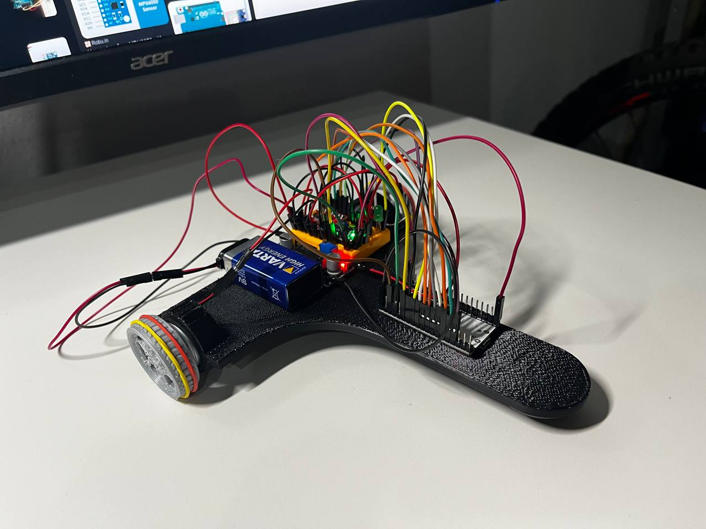

# Differential Robot

## Parts
- DC Motor (without postition encoding) 2x (I took the motors out of old gamepads, that had a rumble feature)
- IMU (GY 521)
- ESP32
- LIPO 3.7V (9V block for now)
- DC-DC converter (for 3.7V to 5V or 9V for motors)
- tb6612fng (motor driver)
- Cables

## Libraries
- Micro-ROS
- jrowbergs Mpu6050 library
- SparkFun TB6612FNG library

## Tasks
### First Problem to Solve
What, if we have 2 motors for our differential wheled robot, but their speed is not aligned?
We need to figure out a control mechanic to align both motors, such that we are able to drive straight forward or make turns as intended.
For that we use a PID controller to adjust the motor speed, to align with the given yaw, that the GY521 sensor is sensing

  

First testing of sensors and motors  

After making sure all the sensors are working as intended and that the motors rotate as intended for the yaw change, it was time to assemble everything on the robot.

 

The motors seem to be a little bit challenged by the weight and need a slight push. I think reducing the weight might lead to the fully designated beahviour.  
Contrary to my believe of just using the PD values of the PD controller, I needed the I term to compensate for the weak motors. 

The next step in line is to make the whole robot more weight efficient and hope for a better performance.

### Second Goal
Idea: Use MPC to drive a straight line, but drive around obstacles automatically and go back to the straight line afterwards

## Ideas
Here are ideas that come up when I am sleeping or in random moments
- IR LED for possible camera tracking
- Magnetometer for more precise direction control
- Kalman Filter for multi sensor integration
- Motors are a little bit too weak at the moment. Try to decrease weight
    - Less infill in model
    - decrease tip length
    - overhaul routing to save some weight for the wires
- Headlight would be cool
- Add sound sensor around robot for object detection
